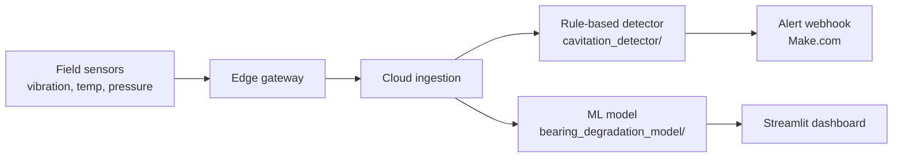

# IIoT Predictive Maintenance — Oil & Gas Rotating Equipment

A two-part Industrial IoT project demonstrating both **rule-based condition monitoring** and **machine learning-based failure prediction** for rotating equipment (pumps, compressors) in oil and gas operations — motivated by real, documented gaps in Nigerian oil and gas maintenance practices.

**Live ML demo:** [iiot-predictive-maintenance.streamlit.app](https://iiot-predictive-maintenance.streamlit.app)

**Live dashboard in action:**


---

## Why this project

Nigerian oil and gas operations face well-documented maintenance gaps:

- Corrosion accounts for over 40% of recorded pipeline failures, driven by inconsistent corrosion inhibitor use
- Most buried pipelines have no leak-detection systems, making breaches hard to catch early
- Many maintenance teams still track equipment health using Excel spreadsheets and institutional memory rather than centralized, real-time sensor data
- A handful of major operators (Chevron Nigeria, NLNG) run real SCADA/predictive analytics systems — but this capability is far from industry-wide

This project is a small-scale demonstration of the kind of system that could help close that gap: a sensor-driven, data-first approach to catching equipment problems before they cause downtime.

---

## Project structure

This repo intentionally separates two different techniques, rather than blending them under one vague "AI-powered" label:

```
IIot-predictive-maintenance/
├── cavitation_detector/        # Rule-based, threshold monitoring
│   └── facility_scada.py
├── bearing_degradation_model/  # Machine learning-based prediction
│   ├── app.py
│   └── bearing_model.pkl
├── requirements.txt
└── README.md
```

### 1. Cavitation detector (rule-based)

Simulates a critical failure mode — **pump cavitation** — common in industrial oil and gas assets, using an Edge-to-Cloud architecture: multi-parameter data is generated and analyzed locally (the Edge, in Python) and critical alerts are pushed into an automated cloud workflow via Webhooks (Make.com).

Uses **multivariate thresholding** to reduce the false positives common in single-parameter monitoring — cavitation is flagged only when high vibration and low pressure are detected together, not from either signal alone.

- **Failure mode targeted:** Pump cavitation (correlation of high vibration + low pressure)
- **Why rule-based, not ML:** cavitation is a fast-onset, threshold-crossing event rather than a gradual trend, so a rule-based check is the appropriate, industry-standard tool here — not every problem needs machine learning.

**Conceptual blueprint:**


**Running it:**

1. Configure `WEBHOOK_URL` in `cavitation_detector/facility_scada.py`
2. Set up the receiving scenario in Make.com
3. Run: `python cavitation_detector/facility_scada.py`


### 2. Bearing degradation predictor (machine learning)

Predicts Remaining Useful Life (RUL) for rotating equipment based on sensor trends, trained on NASA's CMAPSS FD001 dataset.

- **Why CMAPSS:** real, sensor-level oil & gas equipment data is proprietary and not publicly available. CMAPSS (turbofan engine degradation data) is a widely used academic and industry proxy for this exact problem — a machine degrading gradually until failure — and the same modeling approach applies directly to pump/compressor bearing wear.
- **Approach:**
  - Identified and dropped 7 "dead" (zero-variance) sensors out of 21, based on standard deviation analysis
  - Engineered rolling-average (5-cycle window) features per sensor to capture degradation trend rather than noisy single readings
  - Capped RUL at 125 cycles during training — since sensor data shows no meaningful signal during early healthy operation, capping focuses the model on the learnable degradation phase (standard practice in CMAPSS research)
  - Trained a Random Forest Regressor (100 trees)
- **Result:** Mean Absolute Error of **10.54 cycles** on held-out test data (vs. 55.63 cycles for a naive "always predict the average" baseline)
- **Deployed** as an interactive Streamlit dashboard — enter recent sensor readings, get a predicted RUL with a color-coded health status (healthy / degrading / critical)

---

## System architecture (conceptual)



---

## Tech stack

- **Data & ML:** Python, pandas, scikit-learn, NASA CMAPSS FD001 dataset
- **Dashboard:** Streamlit
- **Alerting pipeline:** Python `requests`, Make.com webhooks
- **Infrastructure:** Docker, GitHub Actions (CI), VS Code

## Key engineering concepts demonstrated

- **IIoT data simulation:** handling multi-variable, multi-sensor time-series data
- **Condition-Based Monitoring (CBM):** threshold-based intervention using live asset health signals
- **Prognostics:** trend-based Remaining Useful Life estimation using machine learning
- **Asset integrity & safety:** correlating multiple signals to improve alert reliability
- **MLOps basics:** training a model, saving it, and deploying it as a live, usable web app

## Skills demonstrated

Data cleaning & feature selection · time-series feature engineering · supervised regression modeling · model evaluation against a baseline · deployment of an ML model as a live web app · rule-based systems design · cloud alerting integration · systems/architecture thinking

---

## Running locally

```bash
git clone https://github.com/anthonyattoh/IIot-predictive-maintenance.git
cd IIot-predictive-maintenance
pip install -r requirements.txt
streamlit run bearing_degradation_model/app.py
```

---

## Future work

- Replace simulated random sensor data in the cavitation detector with a realistic drifting/degrading simulation
- Expand the ML model to classify failure type, not just estimate RUL
- Explore real, anonymized industrial vibration datasets as they become available

---

## Dataset acknowledgment

Saxena, A., Goebel, K., Simon, D., & Eklund, N. (2008). *Damage propagation modeling for aircraft engine run-to-failure simulation.* International Conference on Prognostics and Health Management. NASA Ames Prognostics Data Repository.
