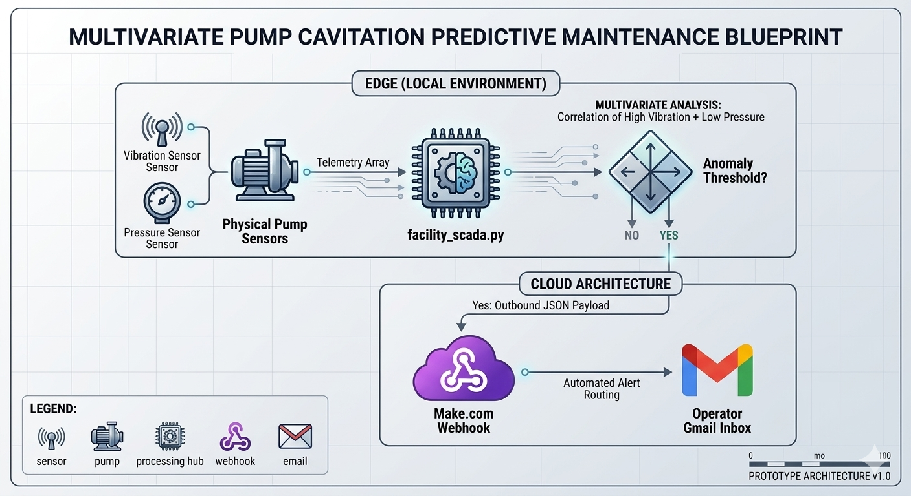
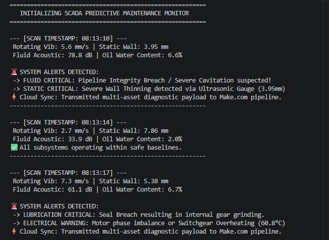

# Multivariate Pump Cavitation Predictive Maintenance Prototype

## 1. Overview
This project simulates a critical failure mode—**pump cavitation**—common in industrial oil and gas assets. It demonstrates an 'Edge-to-Cloud' architecture where multi-parameter data is generated and analyzed locally (the Edge) using Python, and critical alerts are integrated into an automated cloud workflow (using Webhooks/Make.com).

## 2. Industrial Logic & Multivariate Architecture
This system utilizes **multivariate thresholding** to enhance reliability and reduce false positives common in single-parameter monitoring.

* **Failure Mode Targeted:** Pump Cavitation (detected by a correlation of high vibration + low pressure).
* **The Blueprint (Conceptual Flow):**

## 3. Technology Stack
* **Data Generation & Analysis:** Python 3.x (libraries: `random`, `time`).
* **Cloud Integration:** Python `requests` library (for Webhooks), Make.com.
* **Development & Containerization:** VS Code / Terminal / Docker (Isolated Edge Environment).

## 4. Key Engineering Concepts Demonstrated
* **Industrial Internet of Things (IIoT) Data Simulation:** Handling multi-variable time-series data.
* **Condition-Based Monitoring (CBM):** Transitioning from scheduled to predictive intervention based on live asset health signals.
* **Asset Integrity & Safety:** Applying logical correlation to enhance the reliability of critical industrial equipment.

## 5. Deployment & Simulation
*(This section outlines installation and how to run the simulation.)*

1. Configure the `WEBHOOK_URL` in `facility_scada.py`.
2. Set up the receiving scenario in Make.com.
3. Execute: `python facility_scada.py`

  

This project is a functional proof-of-concept for minimizing critical industrial downtime through proactive, multivariate analytics.